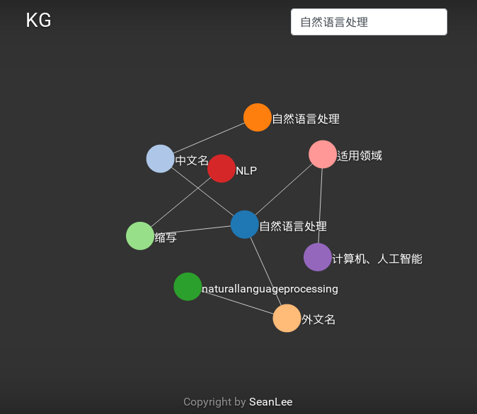

# TripleIE

# 推荐使用 [TDEER](https://github.com/4AI/TDEER) 来训练三元组抽取模型

关系知识图谱的构建中，三元组的抽取很重要，三元组的抽取其实可以认为是结构化数据的提取。
那么如何在自然语言处理中提取三元组呢？我能想到的最简单的方式就是通过句法分析来实现了。

目前支持挖掘的关系有：
- 主谓宾
- 动宾定语后置
- 人名/地名/机构

#### requirements
```
python 2.7 / python3.5+
pyltp
LTP V3.4.0
```

##### LTP的安装
我的CentOS 7.0 使用LTP v3.3.1的模型失败了，请使用新版[v3.4.0](http://ltp.ai/download.html)的模型

#### usage

```
python3 cli.py --data /path/to/input --out /path/to/save --ltp /path/to/ltpdata

--data 指定处理的文本文件路径
--out  指定输出结果的路径
--ltp  指定ltp模型文件路径
```
#### 例子

##### 原文

```
唐纳德·特朗普（Donald Trump），1946年6月14日生于纽约，美国共和党籍政治家、企业家、商人，第45任美国总统。
1968年从宾夕法尼亚大学沃顿商学院毕业后，进入其父的房地产公司工作，并在1971年开始掌管公司运营，正式进军商界。在随后几十年间，特朗普开始建立自己的房地产王国，人称“地产之王”。除房地产外，特朗普将投资范围延伸到其他行业，包括开设赌场、高尔夫球场等。他还涉足娱乐界，是美国真人秀《名人学徒》等电视节目的主持人，并担任“环球小姐”选美大赛主席。美国杂志《福布斯》曾评估特朗普资产净值约为45亿美元，特朗普则称超过100亿美元。
特朗普在过去20年间分别支持过共和党和民主党各主要总统竞选者。2015年6月，特朗普以共和党竞选者身份正式参加2016年美国总统选举。此前，特朗普没有担任过公共职务。特朗普结过3次婚，育有5个子女。 [1]  2016年11月9日，唐纳德·特朗普已获得了276张选举人票，超过270张选举人票的获胜标准，当选美国第45任总统。 [2]  2017年1月20日，特朗普正式成为美国第45任总统。
2018年8月7日，西好莱坞市市议会投票通过“特朗普之星”将永久移除
```
##### 结果
```
主谓宾  (Trump, 生于, 纽约)                                                                                                                           
主谓宾  (美国共和党籍政治家, 任, 美国总统) 
动宾定语后置    (房地产公司, 进入, 其父) 
主谓宾  (他, 涉足, 娱乐界) 
主谓宾  (环球小姐, 选, 美大赛主席) 
主谓宾  (特朗普资产净值, 为, 45亿美元) 
主谓宾  (特朗普, 称, 超过100亿美元) 
主谓宾  (特朗普, 支持, 共和党各主要总统竞选者) 
主谓宾  (特朗, 普结, 婚) 
主谓宾  (唐纳德·特朗普, 获得, 276张选举人票) 
动宾定语后置    (获胜标准, 超过, 270张选举人票) 
主谓宾  (超过270张选举人票获胜标准, 当选, 美国第45任总统) 
主谓宾  (特朗普, 成为, 美国第45任总统)
```
可以看到，目前效果不咋地。。

##### 小尝试结合结构化数据构建可视化图谱


#### TODO
- [ ] 指代消解

